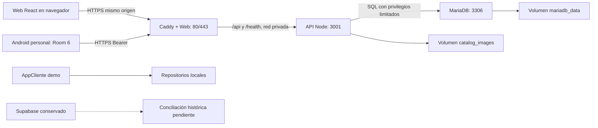

# Vivero Dulcinea: manual técnico para Toni

**Fecha:** 5 de octubre de 2026, America/Chihuahua.
**Objetivo:** localizar, desarrollar y mantener el sistema sin confundir evidencia,
operación real, prototipos ni planes. [Resumen breve](toni-resumen-tecnico.md).

## Alcance y forma de verificación

Esta entrega consultó código, Git, documentación y VPS por SSH, con operaciones de
solo lectura. Se inspeccionaron rutas/enlaces, metadatos Docker, puertos, versiones,
sudo, archivos de configuración por nombre y modo, SQL agregado sin datos personales,
hashes de fuentes/artefactos y respaldo. Se consultó ADB para versiones instaladas.
No se cambiaron servicios, datos, cuentas, contraseñas, DNS ni configuración privada.

| Fuente | Referencia revisada |
|---|---|
| ViveroApp / backend / MariaDB / Docker | `main`, `3369bbb95179ec62daa4d369efd61b5cef3d5097` |
| Commit de backend e infraestructura | `839a5af` (padre de la entrega Android) |
| ViveroWeb | `main`, `62d027e7aab3c1cdcd4dd3976e87cc922ed29e9e` |
| GitHub | Los HEAD remotos de ambos repositorios coinciden con esas referencias |
| ViveroAppCliente | Carpeta sin `.git`; no se puede atribuir commit o remoto |
| VPS | `179.236.238.111`, Hostinger 2030059, `srv2030059.hstgr.cloud` |

Los checkouts conservan modificaciones ajenas a la entrega publicada: IDE,
seguimiento/README y auditorías; Web también conserva cambios del lockfile.
Leer el README del commit para el checkpoint publicado. Los documentos antiguos
registran su fecha: frases como «sin push» o «Web aún usa Supabase» no describen
el estado actual. No convertir esos antecedentes en nuevos resultados.

### Estado validado actual (5 de octubre de 2026)

| Componente | Estado | Evidencia |
|---|---|---|
| **Web (ViveroWeb)** | ✅ Verde | 475 tests Vitest, lint y build (tsc + vite) exitosos |
| **Backend (API + MariaDB)** | ✅ Verde | 10 tests integration + purchases-integration + sales + cashier; migración 030 aplicada |
| **Android (ViveroApp)** | ✅ Verde | testDebugUnitTest, assembleDebug, lintDebug exitosos |
| **APK Debug** | Generada | `1.0.7-vps`, versionCode 8, `app/build/outputs/apk/debug/app-debug.apk` (53.4 MB) |
| **Backend objetivo** | Producción | `https://viverodulcinea.bajastack.network` (HTTPS) |
| **Migración BD** | 030 aplicada | Tabla `purchase_draft_retirements` creada, 56 tablas totales |
| **Recovery/Retire** | Validado | Backend + Web + Android (tests de integración y unitarios) |

## A. Arquitectura y tecnologías



Caddy también sirve archivos estáticos de la SPA y sus rutas profundas. La API
es autoridad de permisos, precios, pagos, inventario e idempotencia. Room conserva
carritos e intentos locales; no sustituye la validación del servidor. El grafo Android
activo abre reportes/administración en Web; cámara y paridad administrativa nativa
completa siguen fuera del recorrido migrado.

| Componente | Versiones comprobadas y tipo de evidencia |
|---|---|
| Web | Paquetes instalados: React 19.2.8, React Router 7.18.2, Vite 7.3.6, TypeScript 5.8.3; Vitest 4.1.11; **475 tests ✅, lint ✅, build ✅** |
| Android personal | Catálogo Gradle: AGP 9.2.1, Kotlin 2.2.10, Compose BOM 2026.02.01, Hilt 2.59.2, KSP 2.3.10, Room 2.8.4, Ktor 3.3.3, Coil 2.7.0 |
| Android personal / SDK | **APK debug 1.0.7-vps, código 8**; compileSdk 37, targetSdk 36, minSdk 24; compilación con JDK 17 (Temurin) |
| API | Runtime del contenedor Node v24.21.0; package.json fija mysql2 3.24.5 y sharp 0.35.5 |
| MariaDB | Consulta al servidor: 11.4.13-MariaDB-ubu2404; imagen declarada `mariadb:11.4` |
| VPS | Ubuntu 24.04.5 LTS; Docker Engine 29.8.2, Compose 5.6.0 |
| Proxy | Caddy v2.11.6, imagen construida desde `caddy:2-alpine` |
| Restic | 0.16.4 instalado; copia externa todavía no configurada |
| AppCliente | AGP 9.3.3, Kotlin 2.2.10, Compose BOM 2026.02.01; versión 1.0, código 1; target/compile 37, min 24; **sin Git, sin integración backend** |

Los rangos npm de package.json no son la versión resuelta: consultar lockfile.
El del VPS Web coincide con la copia local modificada, pero no con Git en
`brace-expansion` (dos entradas) y `js-yaml`, dependencias de desarrollo. Resolver
esa diferencia y validar una construcción limpia antes del siguiente despliegue;
no se publicaron cambios de dependencias ajenos para ocultarla.

Supabase sigue presente en dependencias y fuentes históricas: Kotlin 3.2.6 en
Android y supabase-js 2.112.3 en Web. El grafo personal usa BackendAuthViewModel y
Backend*Screen; BuildConfig de Supabase está vacío. La sesión Web activa usa su
controlador API; el bundle comprobado anteriormente no incluía SDK Supabase.
No existe fallback operativo autorizado ni sincronización automática entre motores.
El servicio remoto Supabase no se consultó en esta entrega.

## B. Mapa de ubicaciones

Raíz local compartida de Pedro: `C:\Users\GAMER\AndroidStudioProjects`.
Toni puede elegir otra carpeta; ViveroApp y ViveroWeb deben ser hermanos para Compose.

| Componente | Repositorio / carpeta local | Ruta VPS | Servicio / contenedor | Acceso | Propósito |
|---|---|---|---|---|---|
| Web | `ViveroWeb/src`, Dockerfile | `/opt/vivero/releases/20261002-initial/ViveroWeb` | `web` / `vivero-vps-web-1` | Dominio definitivo HTTPS | SPA y entrada HTTP |
| Android personal | `ViveroApp/app` | No servicio Android en VPS | `com.intutec.viveroapp` en dispositivo | API HTTPS | Operación del personal |
| API | `ViveroApp/backend` | `.../ViveroApp/backend` bajo la release | `api` / `vivero-vps-api-1` | Privado 3001, a través de Caddy | Contratos y reglas de negocio |
| MariaDB | `ViveroApp/database/mysql` | Fuentes en release; datos en volumen Docker | `db` / `vivero-vps-db-1` | Privado 3306 | Base `vivero` |
| Imágenes | API y `product_images` | Volumen `vivero-vps_catalog_images` | Montado API en `/data/catalog-images` | Rutas de API | Archivos de catálogo |
| Infraestructura | `ViveroApp/infra/docker`, `infra/host` | Release y `/srv/apps/vivero-dulcinea/ops` | Compose `vivero-vps` | Mantenimiento SSH | Servicios, respaldo y wrapper |
| Proxy | Caddyfile de ViveroApp | `/srv/proxy/Caddyfile` enlazado a release | Mismo contenedor `web` | 80/443 públicos | HTTPS compartible, aún dependiente |
| Respaldos | Herramientas en `infra/docker` | `/var/backups/vivero` | No servicio permanente de copia | Privado administrador | Lotes SQL/imágenes |
| AppCliente | `ViveroAppCliente/app` | No ruta o servicio desplegado acreditado | `com.intutec.viveroappcliente` | Demo local | Prototipo para cliente final |

`...` en la tabla significa `/opt/vivero/releases/20261002-initial`; no es una ruta
para copiar literalmente. La carpeta `/opt/vivero` contiene releases, shared y
maintenance. `/srv/apps/vivero-dulcinea`, `/srv/proxy` y `/var/backups/vivero` son
directorios reales. Se verificaron estos enlaces:

```text
/srv/apps/vivero-dulcinea/current     -> /opt/vivero/releases/20261002-initial
/srv/apps/vivero-dulcinea/releases    -> /opt/vivero/releases
/srv/apps/vivero-dulcinea/shared      -> /opt/vivero/shared
/srv/apps/vivero-dulcinea/maintenance -> /opt/vivero/maintenance
/srv/apps/vivero-dulcinea/backups     -> /var/backups/vivero
/srv/backups/vivero-dulcinea          -> /var/backups/vivero
/srv/proxy/Caddyfile                 -> release/ViveroApp/infra/docker/Caddyfile
```

`release/` en la última línea representa la release completa indicada arriba.
El Compose `platform-proxy` es una propuesta: no hay proyecto independiente activo.

Git contiene fuentes, migraciones, scripts, pruebas y plantillas; no incluye
credenciales, exportaciones reales, APK ni respaldos. El VPS utiliza imágenes
construidas y fuentes transferidas, no un checkout cuyo HEAD pruebe el despliegue.
Se compararon 287 archivos de fuentes/configuración: 286 coinciden con la copia
local, admitiendo diferencias LF/CRLF; difiere `infra/docker/vps.env.example`.
Las fuentes API dentro del contenedor coinciden con la release y los 19 assets Web
coinciden con el build local. Esto no acredita igualdad de todo el VPS con Git,
especialmente por el lockfile ya señalado, `.env` privados y overlay del host.

## C. Docker y red

Administración vigente: base, overlay VPS y overlay host, conservando `-p vivero-vps`.
Un administrador puede definir esta función en su sesión Bash; no inicia servicios:

```sh
vivero_compose() {
  docker compose --env-file /opt/vivero/shared/.env.vps -p vivero-vps \
    -f /opt/vivero/releases/20261002-initial/ViveroApp/infra/docker/compose.yaml \
    -f /opt/vivero/releases/20261002-initial/ViveroApp/infra/docker/compose.vps.yaml \
    -f /srv/apps/vivero-dulcinea/ops/compose.host.yaml "$@"
}
vivero_compose config --quiet
vivero_compose ps
```

Toni no tiene permiso Docker directo; utiliza el wrapper de la sección H. La
etiqueta antigua de DB menciona compose.private.yaml porque ese contenedor no se
recreó. No añadir ese overlay a producción: el acceso real actual es público por Web.

| Servicio activo | Imagen en ejecución, ID corto | Estado / puertos |
|---|---|---|
| `vivero-vps-api-1` | `vivero-vps-api:latest`, `a63e49422463` | running, healthy; 3001 sin publicar |
| `vivero-vps-db-1` | `mariadb:11.4`, `1292844148b3` | running, healthy; 3306 sin publicar |
| `vivero-vps-web-1` | `vivero-vps-web:latest`, `9534ad0c5276` | running; 80/443 IPv4/IPv6; sin healthcheck Docker |

SSH escucha en 22 IPv4/IPv6. Caddy admin 2019 no está publicado. El ensayo
`vivero-acceptance-20261003` tiene Web/API/DB activos en redes propias y únicamente
Web publicada en `127.0.0.1:38003`; no es el entorno operativo. El ensayo
`vivero-restore-check-20261003` conserva API/DB detenidos y sus volúmenes. Su último
health almacenado como unhealthy no describe la salud de producción.

| Red | Tipo y participantes comprobados |
|---|---|
| `vivero-vps_database` | Interna; API y DB |
| `vivero-vps_api` | Bridge; Web y API |
| `platform_proxy` | Externa respecto a Compose, bridge; solo Web de Vivero |

Volúmenes: `vivero-vps_mariadb_data`, `vivero-vps_catalog_images`,
`vivero-vps_caddy_data`, `vivero-vps_caddy_config`. No renombrar el proyecto para
«ordenarlo»: un `-p` diferente puede crear volúmenes nuevos y aparentar pérdida de datos.

Caddyfile está montado en `/etc/caddy/Caddyfile`. El dominio canónico sirve SPA y
API; `bajastack.network/` devuelve 307 al nuevo dominio. `/caja`, `/login`, assets,
API y health del origen anterior se conservan temporalmente: localStorage no se
traslada entre dominios y hay intentos antiguos que deben recuperarse allí.

Antes del segundo proyecto: respaldar TLS/config, crear Compose `platform-proxy`
en `/srv/proxy`, reutilizar volúmenes TLS como externos con un solo escritor,
convertir Web de Vivero a HTTP interno y transferir 80/443 en una ventana acordada.
Verificar dominio, API y rollback antes de conectar otras aplicaciones. Ese cambio
no está ejecutado. La red ya creada no equivale a proxy independiente.

## D. Base de datos

Base `vivero`, servidor MariaDB 11.4.13. El volumen de datos se monta en
`/var/lib/mysql` del contenedor; su ruta lógica en host es
`/var/lib/docker/volumes/vivero-vps_mariadb_data/_data`. No editar esos archivos.
Fuentes: schema.sql, grants.sql, seed.sql local sintético, seed-production.sql
de roles y **29 migraciones** `002_identity` a `030_purchase_draft_retirement`.

| Grupo | Tablas principales y responsabilidad |
|---|---|
| Identidad | users, roles, permissions, role_permissions, branches; roles/capacidades y sucursal |
| Acceso | auth_sessions, auth_login_limits, account_links, administration_changes; sesiones, límites y auditoría |
| Catálogo | categories, products, product_images, promotions, promotion_products; precios y archivos |
| Ventas/caja | sales, sale_items, sale_status_history, sale_payment_claims, cashier_payments; envío, reserva y pago |
| Conciliación | sale_attempt_retirements, payment_attempt_retirements; cierre seguro de intentos |
| Inventario | inventory, inventory_movements, inventory_counts; saldo por producto/sucursal y movimientos auditados |
| Operación ampliada | customers, web_orders y partidas/estados; pedidos y clientes |
| Finanzas/compras | cashier_closings y vínculos, sale_refunds, suppliers y supplier_purchase_*; cortes, devoluciones y compras |
| Boletín | newsletter_subscribers, newsletter_campaigns, newsletter_deliveries; contratos de envío |
| Migración | schema_migrations y familias catalog_*_sources, identity_*_sources, history_*_sources, inventory_*_sources; correspondencias de origen |

Las relaciones usan claves foráneas y IDs enteros; dinero en centavos enteros.
Una venta vincula vendedor/sucursal, partidas y pagos; inventario vincula producto
y sucursal. La API recalcula precios, exige capacidades y conserva claves de
idempotencia. No convertir UUID antiguos de Room en IDs MariaDB ni volver a cobrar
historial importado. Autenticación propia con scrypt/sal individual y sesiones
Bearer revocables; cambiar contraseña revoca sesiones y enlaces en transacción.
El cambio personal admite 6-128 caracteres; creación administrativa y enlaces
mantienen mínimo 15. No copiar hashes o credenciales a fixtures/documentos.

Comprobación agregada: **56 tablas** (migración 030 `purchase_draft_retirements` aplicada), seis cuentas (cinco sin contraseña), dos sucursales,
15 productos, cero imágenes, 16 ventas (14 PAID y dos SENT_TO_CASHIER), 14 pagos y
38 movimientos. No se exportaron nombres, correos de cuentas ni clientes.

Consulta por consola, **solo administrador con Docker autorizado**, solicita
contraseña de manera interactiva; no colocar su valor en el comando:

```sh
docker exec -it vivero-vps-db-1 mariadb -u root -p vivero
```

Dentro de MariaDB, consultas de solo lectura:

```sql
SHOW TABLES;
SELECT COUNT(*), MAX(version) FROM schema_migrations;
SELECT code, inventory_enabled FROM branches;
SELECT status, COUNT(*) FROM sales GROUP BY status;
```

`catalog_api` es el usuario SQL de la API, con privilegios limitados; `root` se
reserva para mantenimiento. No son usuarios SSH ni cuentas de aplicación.
No hay cliente visual, puerto DB al host ni túnel de administración configurado
acreditado. Para habilitar uno después, acordar usuario SQL de lectura y un túnel
SSH al destino privado validado; nunca abrir 3306 a Internet. Toni no dispone de
consulta DB por su sudo actual.

## E. Desarrollo y despliegue

### Local: obtener las fuentes

```sh
git clone https://github.com/NeronXV/ViveroApp.git
git clone https://github.com/NeronXV/ViveroWeb.git
```

Clonar en una carpeta de desarrollo, no encima de checkouts existentes. Verificar
HEAD y estado antes de trabajar. Leer AGENTS.md; los contratos oficiales están
en ViveroApp, no duplicar backend en Web. AppCliente no tiene remoto acreditado:
solicitar su entrega privada y acordar versionado antes de integrarla.

### API y MariaDB locales

Requisitos: Docker con motor Linux y Compose compatible, Node 24 para npm fuera
de Docker. Los comandos siguientes modifican **solo el entorno local nuevo**;
son el procedimiento documentado/verificado anteriormente, no una ejecución nueva
en esta entrega. No apuntarlos al VPS. En ViveroApp copiar `.env.example` a `.env`
solo si no existe, crear contraseñas independientes, fijar WEB_ORIGIN al origen
local de Web y configurar BOOTSTRAP con cuenta sintética y sucursal DEMO.

```sh
docker compose --env-file .env -p vivero-toni-local \
  -f infra/docker/compose.yaml config --quiet
docker compose --env-file .env -p vivero-toni-local \
  -f infra/docker/compose.yaml up -d --build --wait api
docker compose --env-file .env -p vivero-toni-local \
  -f infra/docker/compose.yaml --profile tools run --build --rm migrate
docker compose --env-file .env -p vivero-toni-local \
  -f infra/docker/compose.yaml --profile tools run --build --rm bootstrap
curl --fail http://127.0.0.1:3001/health
```

El primer arranque inicializa schema, demo, grants y migraciones. En un volumen
existente usar migrate para pendientes; bootstrap es una sola vez. No usar
`down -v`, prune o reinicializar la base si hay un fallo. Elegir API_PORT libre;
si cambia, actualizar proxy y URL Android. En PowerShell escribir comandos en
una línea o usar su continuación propia; las barras finales anteriores son Bash.

### Web local

Desde ViveroWeb, Node 24; BACKEND_PROXY_TARGET permite únicamente API loopback.
Web utiliza `/api/v1` por Vite, no secretos VITE. El contrato de origen exige
coincidencia: usar `WEB_ORIGIN=http://localhost:5173` en la API local.

```sh
npm ci
npm run dev -- --host localhost
```

El proxy por defecto es `http://127.0.0.1:3001`; para otro puerto configurar
BACKEND_PROXY_TARGET en `.env.local` ignorado. No reutilizar secretos del VPS.
Los restos Supabase de .env.example no son necesarios para la sesión API activa.

### Android

Abrir ViveroApp en Android Studio, sincronizar con SDK 37 y JDK compatible
(la evidencia actual usa **JDK 17 Temurin** desde `~/.gradle/jdks/`). En local.properties privado configurar
BACKEND_API_URL y BACKEND_WEB_URL; no dejar rutas productivas para pruebas con escrituras.
Debug permite HTTP solo para localhost, 127.0.0.1 y 10.0.2.2; release exige HTTPS.
El proyecto conserva appId `com.intutec.viveroapp`, Room 6 y migraciones no destructivas.

```powershell
.\gradlew.bat assembleDebug testDebugUnitTest lintDebug
```

APK: `app/build/outputs/apk/debug/app-debug.apk` (**53.4 MB**, versión **1.0.7-vps**, código **8**).
La copia entregada está bajo
`tmp/vps-operational-cutover/Vivero-Dulcinea-VPS-1.0.6.apk`, ignorada y privada.
No subir APK a Git. Para actualizar con ADB, verificar appId/firma, respaldar datos
y usar `adb install -r RUTA_APK`; no desinstalar para resolver incompatibilidades.

Firma debug comprobada:
`54aae00dc34e2e48e287effbb513afb47e448e3e83470ccecb4b42851acf9cb6` (SHA-256).
Release requiere key.properties, almacén existente y variables RELEASE_BACKEND_*.
No se acreditó una firma release lista para distribución. Una firma diferente
no puede actualizar directamente esta instalación. Definir el canal y compatibilidad
antes de generar la entrega definitiva. Las pruebas connectedDebugAndroidTest
retiraron la app operativa durante un ensayo previo y obligaron a restaurar su base:
usar paquete/dispositivo aislado para futuras instrumentadas, no el equipo diario.

### Validar, publicar y desplegar

1. Revisar rama/HEAD/status; preservar cambios ajenos y usar una rama acordada.
2. Probar backend con `npm --prefix backend test` y `npm --prefix backend run check`;
   Android con `.\gradlew.bat testDebugUnitTest assembleDebug lintDebug`; Web con lint, test y build. Pruebas SQL/HTTP
   adicionales solo en proyectos aislados con fixtures sintéticos.
3. Revisar diff, `git diff --check` y secretos; seleccionar archivos, commit y push
   con autorización. Toni necesita acceso GitHub propio; no está verificado aquí.
4. Administrador prepara release con ambos repositorios hermanos y manifiesto de
   hashes, registra imágenes previas, revisa diferencias del lockfile y conserva
   configuración privada. `current` por sí solo no actualiza contenedores.
5. Verificar respaldo e impacto; explicar pausa antes de migrar/recrear. Migraciones
   solo pendientes, después de detener escritores cuando corresponda.
6. Construir y recrear exclusivamente servicios afectados, usando nombre Compose
   y volúmenes existentes. No ejecutar estos pasos con los permisos limitados de Toni.
7. Verificar HTTPS, permisos y flujos, documentar qué imagen quedó activa y crear
   respaldo posterior. Un commit no demuestra que el VPS lo esté ejecutando.

Ejemplo de actualización **MODIFICA/RECREA API, solo administrador y ventana acordada**:

```sh
vivero_compose build api
vivero_compose up -d --no-deps api
```

No ejecutar automáticamente: depende de la release e imagen elegidas. En los
despliegues recientes se construyó una candidata, se probó aisladamente y se cambió
el tag operativo con guardas de hashes y de volúmenes.

### Volver a una versión anterior

Reversión API más reciente disponible: `vivero-vps-api:before-password-minimum-20261003`
(`1fe76453955d`); evidencia en `/opt/vivero/maintenance/20261003-password-minimum`.
Para Web antes de la corrección de stock existe
`vivero-vps-web:before-stock-fix-20261003` (`77cc446fb883`), que también reintroduce
el mensaje incorrecto de inventario. No confundir rollback de dominio con rollback
de datos; revisar compatibilidad del código, esquema y configuración antes de elegir.

Procedimiento **MODIFICA SERVICIOS**, reservado al administrador: registrar imagen
actual, seleccionar tag anterior verificado, reasignar el tag operativo y recrear
solo el servicio correspondiente con Compose vigente; comprobar health/HTTPS y
montajes. Las evidencias de mantenimiento conservan fuentes anteriores y hashes.
No restaurar una base antigua para revertir una pantalla ni bajar versión Android
con Room incompatible. Reversión SQL exige plan separado; no hay reversión destructiva
automática. Guías: [contraseña](backend-personal-password.md),
[dominio](vps-canonical-domain.md) y [operación](vps-multiproject-operations.md).

## F. Accesos y configuración

```sh
ssh toni@179.236.238.111
# Si la llave privada tiene otro nombre:
ssh -i RUTA_LLAVE_PRIVADA toni@179.236.238.111
```

Huella ED25519 del host registrada en la verificación anterior:
`SHA256:/WRISCh2bIoTLHSRwzQY8niIR+z46J6Y7789J9Y8RC8`.
Confirmarla por vía privada con Pedro al primer ingreso; no desactivar comprobación
del host. La llave de Toni es independiente. `pedro` y `toni` tienen contraseña SSH
bloqueada y no pertenecen al grupo Docker. Pedro ya probó SSH anteriormente;
Toni debe confirmar llave privada, conectividad y login desde su propio equipo.

Su sudo permite exclusivamente: status, validate, logs api/web/db, proxy-check,
proxy-reload y backup --acknowledge-downtime mediante viveroctl.sh. No concede
root general, Docker libre, restauración, despliegue, DB, offsite o edición de secretos.
Las políticas se comprobaron con `sudo -l -U`; no se ampliaron para este documento.

| Configuración | Ruta / variables, sin valores privados |
|---|---|
| VPS privado | `/opt/vivero/shared/.env.vps`, modo 600: MARIADB_ROOT_PASSWORD, MARIADB_PASSWORD, NEWSLETTER_LINK_KEY, VIVERO_DOMAIN, VIVERO_LEGACY_DOMAIN, WEB_ORIGIN_ALIASES |
| Acceso inicial | `/opt/vivero/shared/.env.bootstrap`, modo 600: BOOTSTRAP_EMAIL, BOOTSTRAP_FULL_NAME, BOOTSTRAP_BRANCH_CODE, BOOTSTRAP_BRANCH_NAME, BOOTSTRAP_PASSWORD |
| Local API | `.env` ignorado: variables DB, API_PORT, WEB_ORIGIN y BOOTSTRAP para entorno nuevo |
| Android | `local.properties`: BACKEND_API_URL, BACKEND_WEB_URL, RELEASE_BACKEND_API_URL, RELEASE_BACKEND_WEB_URL; `sdk.dir` local |
| Firma Android | `key.properties`: storeFile, storePassword, keyAlias, keyPassword; keystore privado |
| Correo pendiente | RESEND_API_KEY, ACCOUNT_MAIL_FROM, NEWSLETTER_FROM; configuración solo servidor |
| R2 pendiente | shared/offsite.json y offsite.password NO existen; futura configuración de repositorio, AWS_ACCESS_KEY_ID, AWS_SECRET_ACCESS_KEY, AWS_DEFAULT_REGION |

La credencial BOOTSTRAP puede quedar obsoleta después del cambio personal de
contraseña: no resetear una cuenta para ejecutar diagnósticos. No compartir
contraseñas por Git, chat, capturas o argumentos de comandos. Pedro entrega acceso
mediante gestor de contraseñas o canal privado acordado; para local generar secretos
nuevos. Esta guía no transfiere credenciales ni prueba permisos GitHub de Toni.

## G. Respaldos y recuperación

Ocho lotes COMPLETE, 16 archivos SQL/imágenes verificados por SHA-256 en esta
revisión. Contienen database.sql, catalog-images.tar.gz, manifest.json y COMPLETE.
Total de lotes: aproximadamente 0.975 MiB (1.022 MB); mayor lote 170,183 bytes (0.162 MiB).
Son tamaños actuales de un sistema pequeño, no proyección de crecimiento.

Último lote: `vivero-2026-10-03T23-35-15-700Z-415873eb-5808-4ad7-ab7f-31e919e95219`.
Está en `/var/backups/vivero` y sus dos enlaces bajo /srv apuntan a la misma copia.
No son tres respaldos independientes. No hay timer/cron de Vivero o Restic localizado
en las rutas revisadas; frecuencia actual manual antes/después de cambios.
Retención propuesta, aún no aplicada: 7 diarios, 4 semanales y 6 mensuales.

El respaldo operativo pausa API/Web y exporta SQL e imágenes, sin copiar secretos,
llaves SSH, configuración privada o volúmenes TLS/config de Caddy. Esos elementos
necesitan un respaldo cifrado separado. Hoy hay cero registros product_images;
eso no permite omitir el volumen cuando se carguen imágenes futuras.

Ensayo histórico del 3 de octubre: restauración real del lote de organización en
`vivero-restore-check-20261003`, con redes/volúmenes propios y sin puertos públicos;
conciliación de 55 tablas, migraciones, datos y huellas, pruebas SQL revertidas y
API saludable. Hoy el ensayo está detenido. No se restauró nuevamente para esta
entrega ni se probó restaurar la copia externa del último lote.

Restic 0.16.4 existe y pasó un ensayo cifrado local con datos sintéticos. R2 Standard
fue elegido, pero faltan cuenta/destino, bucket, credencial limitada, custodia de
contraseña y primer envío/recuperación. No hay copia cifrada externa operativa ni
recursos de pago activados por esta tarea. `infra/host/offsite-backup.py` y su
plantilla están preparados; no programan retención ni borran objetos.

La estimación debe considerar imágenes, configuración y crecimiento, además de los
17 puntos de retención. Sin deduplicación, 17 veces el lote mayor son unos 2.76 MiB,
pero R2 tiene metadatos/cifrado y cuota compartida de cuenta todavía no consultada.
No se revisan precios actuales ni se autoriza contratación mediante este manual.

Recuperación: verificar lote y manifiesto; preparar proyecto `vivero-restore-*`
nuevo, credenciales independientes y destino vacío; usar restore-isolated con
overlay privado en maintenance; conciliar DB/imágenes y probar API antes de promover.
No sobrescribir producción ni borrar volúmenes. Ejecuta solo un administrador:

```sh
# MODIFICA EL DESTINO AISLADO; NO EJECUTAR CONTRA PRODUCCIÓN
/srv/apps/vivero-dulcinea/ops/viveroctl.sh restore-isolated \
  /opt/vivero/maintenance/NUEVO_ENSAYO/.env.restore \
  vivero-restore-nuevo /var/backups/vivero/LOTE \
  /opt/vivero/maintenance/NUEVO_ENSAYO/compose.restore.yaml \
  --acknowledge-empty-target
```

Las mayúsculas son marcadores, no rutas existentes. El wrapper exige proyecto
aislado y destino vacío. En el VPS no hay Node global; el wrapper usa Node 24 en
contenedor de mantenimiento. No seguir ejemplos `node ...` directamente en el host
sin adaptar el runtime. Instrucciones completas: [guía operativa](vps-multiproject-operations.md).

## H. Operación y diagnóstico

### Solo lectura, disponibles para Toni

```sh
sudo -n /srv/apps/vivero-dulcinea/ops/viveroctl.sh status
sudo -n /srv/apps/vivero-dulcinea/ops/viveroctl.sh validate
sudo -n /srv/apps/vivero-dulcinea/ops/viveroctl.sh logs api
sudo -n /srv/apps/vivero-dulcinea/ops/viveroctl.sh logs web
sudo -n /srv/apps/vivero-dulcinea/ops/viveroctl.sh logs db
sudo -n /srv/apps/vivero-dulcinea/ops/viveroctl.sh proxy-check
df -h /
free -h
uptime
curl --fail https://viverodulcinea.bajastack.network/health
```

Logs pueden contener datos operativos: consultar en privado, sanitizar antes de
compartir. validate usa config --quiet; no imprimir el Compose expandido ni el
entorno de docker inspect. Un administrador también puede usar docker ps y
docker stats --no-stream, con formatos que no impriman variables privadas.
Medición de esta revisión: 93 GB disponibles en disco, 6.8 GiB de RAM disponibles,
sin swap. Es una medición puntual, no un dimensionamiento para futuros proyectos.

### Comandos que cambian estado

| Acción | Impacto / permiso |
|---|---|
| `proxy-reload` por wrapper | Recarga Caddy; Toni/Pedro autorizados, acordar impacto antes de usar |
| `backup --acknowledge-downtime` | Pausa API/Web, crea lote y reanuda; Toni/Pedro autorizados |
| `verify-backup RUTA` | Lee hashes, inicia contenedor temporal; solo administrador según sudo actual |
| `restore-isolated ...` | Escribe DB/imágenes del ensayo; solo administrador |
| `build`, `up`, migrate/import, bootstrap | Construyen/recrean o modifican datos; administrador y plan específico |
| offsite init/upload | Crea/envía datos externos; configuración/permiso pendientes |

No ejecutar acciones de esta tabla para «ver si funciona» en producción. No usar
down -v, prune, borrado de volúmenes o SQL de saldo como diagnóstico.

| Síntoma | Investigación inicial segura |
|---|---|
| Login | Revisar versión/origen de app, health, respuesta HTTP y cuenta habilitada; cinco cuentas sin contraseña no pueden entrar. No imprimir cuerpos con secretos |
| API 401/403 | Distinguir sesión vencida/revocada de capacidades o sucursal; consultar logs sanitizados. No conceder permisos desde UI |
| API/DB unhealthy | Estado, logs y disco; administrador comprueba red privada/conectividad. No reinicializar volumen |
| Web falla | Probar /health y /login, revisar logs Web/API y Caddyfile; distinguir assets/ruta profunda de API |
| Cobro incierto | Conservar clave, cuerpo y origen localStorage; recuperar resultado original antes de repetir. INVENTORY_INSUFFICIENT es rechazo, no prueba de corte de red |
| Android falla | Confirmar 1.0.6, destino HTTPS y firma; preservar Room/outbox. Logcat solo con filtro y sanitización; no limpiar datos |

Los pagos rechazados por falta de stock se resuelven con revisión operativa de
existencias, no inventando cantidades o desactivando controles. Las rutas de API
que reclaman ventas pueden renovar reservas: no usarlas como consulta inocua.

## I. Estado, aceptación y pendientes

### Evidencia anterior revisada, no reejecutada

- Backend: 87 pruebas aprobadas y syntax check; Android: 356 casos, 355 aprobados,
  uno HTTP opcional omitido; Web: **475 aprobados** en 44 archivos, lint/build correctos.
- **Validación actual (5 octubre 2026):** Backend integration tests (10 + purchases + sales + cashier = 13 tests) ✅; Android testDebugUnitTest + assembleDebug + lintDebug ✅; Web 475 tests + lint + build ✅; Migración 030 aplicada (56 tablas).
- Verificador SQLite: Room 3 a 6, preservación UUID, relaciones y recuperación
  de intentos; no sustituye prueba en todos los dispositivos.
- Ensayo HTTP/SQL aislado: venta, caja, recibo e inventario con datos sintéticos;
  contraseña actual incorrecta, revocación, rollback de auditoría y login nuevo.
- Restauración aislada real y pruebas previas instrumentadas del inicio premium.
  Ver limitación de desinstalación del ensayo en sección E y documentación original.

Esta revisión comprobó salud HTTP, hashes, versiones, agregados DB y permisos;
no hizo una venta, login con credencial personal, cambio de contraseña, restauración
ni pruebas de correo. Pedro informó que pudo instalar y probar acceso; no hay una
lista de aceptación completa firmada para ambos clientes.

| Pendiente | Estado / clasificación |
|---|---|
| Aceptación Web/Android | Necesaria para cerrar Vivero: acceso/sucursal, precios, persistencia, envío, pago, comprobante e inventario, incluidos fallos/red y permisos |
| MATRIZ | Control de inventario activo (1), confirmado por SQL; conteo físico fue confirmado por Pedro anteriormente |
| CENTRO | Control inactivo (0); activar solo con acceso/capacidad y validación operativa correspondientes |
| Historial importado | Conciliación anterior de 14 ventas/pagos documentada; esta entrega solo confirmó agregados, no repitió importación |
| Room antiguo | Dos FAILED sin correspondencia acreditada; copia privada anterior preservada. Falta clasificar ensayo frente a venta real; no se leyó nuevamente la base del dispositivo |
| Ventas recientes | 15 y 16 SENT_TO_CASHIER, sin pago en SQL de esta revisión. Conciliar intentos anteriores con su clave; no se cobraron desde herramientas |
| Cuentas | Cinco sin contraseña; **correo e invitaciones reales pendientes (requiere Resend)**. Cambio personal listo para cuenta habilitada |
| Firma Android | Debug operativa (1.0.7-vps, código 8); estrategia release/distribución pendiente (requiere key.properties compatible) |
| Copia externa | R2/Restic preparado parcialmente; primer envío y recuperación pendientes |
| Reproducibilidad Web | Revisar lockfile de VPS/local frente a Git antes del siguiente build (diferencia en `brace-expansion` y `js-yaml`) |
| AppCliente | Demo local sin conexión ni Git acreditado; definir alcance y versionado |
| Supabase | Conservado; no consultado aquí. No apagar hasta aceptación y conciliación |
| Segundo proyecto | Separar Caddy, respaldar TLS/config y validar independencia; mejora de plataforma necesaria antes de compartir proxy |
| SSH Toni | Configurado; pendiente ingreso desde su equipo, no equivaler a prueba de llave privada |

No se comprobó acceso a GitHub de Toni, consola visual de DB, Cloudflare R2,
correo real, publicación Android en tienda o copias del proveedor Hostinger. La
inspección histórica del proveedor no acreditó respaldo/snapshot válido; no se
volvió a consultar su API para este documento. No prometer protección externa.

## Primeros pasos de Toni

1. Obtener acceso GitHub propio; clonar ViveroApp y ViveroWeb como hermanos y
   confirmar `3369bbb` / `62d027e`. Leer sus AGENTS.md y este manual.
2. Preparar `.env` local con secretos nuevos y DEMO; levantar MariaDB/API y Web.
   Abrir Android Studio y apuntar debug al entorno local antes de probar escrituras.
3. Conectar `ssh toni@179.236.238.111`, confirmar huella con Pedro y ejecutar
   status, validate y proxy-check mediante sudo limitado.
4. Localizar `/srv/apps/vivero-dulcinea`, sus enlaces y la documentación en Git;
   pedir permiso administrativo específico para DB, despliegue o restauración.
5. Acordar con Pedro cierre de aceptación, R2 y separación del proxy; conservar
   Supabase e intentos históricos hasta terminar su conciliación.
